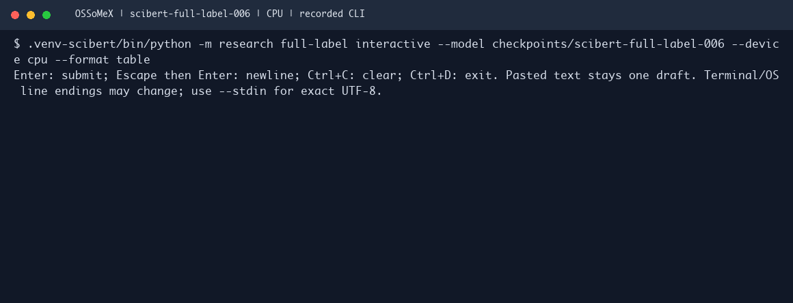

# OSSoMeX

**Open Source Software Mention Extractor**, pronounced *AwesomeX*.

Extract software mentions from research text, associate versions, and propose usage intent, sentiment and local aliases. OSSoMeX is an experimental SciBERT pipeline with five separately trained stages. Outputs include exact source offsets and review flags.

**v0.0.12 is a research preview (Python package 0.0.1).** Names and version links show promising results on selected evaluations; sentiment, aliases and domain generalization need improvement. It does not resolve mentions to repositories or registry IDs.

## Quick start

You need Git, Python 3.11 and space for the approximately 2.6 GB model bundle, plus the Python environment. Run the commands below from the repository root. The macOS instructions use `uv`; if it is not installed, run `python3.11 -m pip install uv` first.

Python 3.11 is the reference environment. CPU inference is supported; use `mps` on a compatible Mac. CUDA is not currently exposed by the CLI. The frozen benchmark lock below was resolved for macOS; use the Linux CPU commands on Linux.

```sh
git clone https://github.com/krushiraj/OSSoMeX.git
cd OSSoMeX
uv venv --python 3.11 .venv-scibert
uv pip sync --python .venv-scibert/bin/python requirements-scibert.lock
uv pip install --python .venv-scibert/bin/python --no-deps -e .
```

For Linux CPU, after cloning and entering the repository, use:

```sh
python3.11 -m venv .venv-scibert
.venv-scibert/bin/python -m pip install torch==2.14.0 --index-url https://download.pytorch.org/whl/cpu
.venv-scibert/bin/python -m pip install -e '.[ml,interactive]'
```

This resolves dependencies for Linux instead of applying the macOS lock. The [contributor workflow](.github/workflows/ci.yml) additionally installs the test dependencies and records its environment.

**Get the model separately.** [Model weights and cards](https://huggingface.co/krushiraj/OSSoMeX) are hosted on Hugging Face; [source and package downloads](https://github.com/krushiraj/OSSoMeX/releases/tag/v0.0.12) are on GitHub. Both repositories are public; downloading the code and model files does not require an account. Git does not contain the weights. See [model installation](docs/models/README.md) for a pinned download or the checksum-verified archive alternative.

```sh
.venv-scibert/bin/hf download krushiraj/OSSoMeX --revision v0.0.12 --local-dir model-assets
.venv-scibert/bin/python -m research full-label predict \
  --model model-assets/checkpoints/scibert-full-label-006 --device cpu \
  --stdin --format table < examples/quickstart.txt

# Keep the model loaded and try your own text.
.venv-scibert/bin/python -m research full-label interactive \
  --model model-assets/checkpoints/scibert-full-label-006 --device cpu --format table
```

If using the archive alternative extracted into this checkout:

```sh
.venv-scibert/bin/python -m research full-label predict \
  --model checkpoints/scibert-full-label-006 --device cpu \
  --stdin --format table < examples/quickstart.txt

.venv-scibert/bin/python -m research full-label interactive \
  --model checkpoints/scibert-full-label-006 --device cpu --format table
```

Use `--format pretty` for the full JSON envelope or `--format jsonl` for compact JSON. `--stdin` preserves exact UTF-8 input; interactive terminal wrapping is not a source-offset guarantee. `--input` accepts JSONL documents with `document_id` and `text`. See [inference and output](docs/usage.md) and the [Python example](examples/predict.py).

## Watch the terminal demo

Four synthetic examples submitted to the real interactive CLI with **checkpoint 006 on CPU**. The model stays loaded between inputs. The animation renders a recorded terminal session; long idle gaps are capped at six seconds, so it is not a timing benchmark. Outputs are unedited experimental predictions.



[Readable transcript](docs/assets/terminal-demo.txt) · [Terminal recording](docs/assets/terminal-demo.cast) · [Samples, controls and troubleshooting](docs/usage.md#interactive-demo)

Press **Enter** to submit, **Escape then Enter** for a newline, **Ctrl+C** to clear the draft and **Ctrl+D** to exit. Pasted multiline text stays in one draft. The `!` marker asks for review; `—` means no value is linked. Switching the model path to `scibert-full-label-012` lets you compare its behavior on the same input.

## Which checkpoint?

| Checkpoint | Role | Limitation |
|---|---|---|
| **006** | Existing name-extraction POC selection; starting point for interactive exploration | Misses names and can invent version associations |
| **012** | Experimental Softcite-adapted detector; fresh three-model comparison | Can miss MATLAB/Java in contexts where 006 succeeds |

012 is not a continuation of 006's detector. No current result establishes one checkpoint as best across all tasks. Both use the same four downstream heads. [Model identities and cards](docs/models/README.md).

## Results at a glance

Exact software-name F1 (%), fresh 012 comparison:

| Evaluation | OSSoMeX 012 | Softcite Wapiti | Softcite SciBERT |
|---|---:|---:|---:|
| OpenAlex fresh30 | 76.4 | 37.5 | 72.7 |
| OpenAlex exposed50 | 56.6 | 44.3 | 42.9 |
| OpenAlex reserve27 | 58.7 | 59.6 | 57.4 |
| Seven regression excerpts | 69.8 | 28.6 | 53.3 |
| Recovered Softcite gold, 461 paragraphs | 75.1 | 93.2 | 92.1 |

The local snippet labels are provisional and development-exposed. Gold and local samples answer different questions; do not pool their scores. Softcite's projected name scope includes languages and excludes implicit mentions. [Methods, precision/recall, limitations and next experiments](docs/research/benchmark-012.md).

## Develop and reproduce

- [Contributor setup and repository map](CONTRIBUTING.md)
- [Architecture and output contracts](docs/architecture.md)
- [Training and evaluation](docs/training.md)
- [Experiment source archive](experiments/README.md)
- [Documentation index](docs/README.md)
- [Release notes](CHANGELOG.md) and [release verification](docs/releases/v0.0.1.md)

Use the maintained `research full-label`, `research comparison`, `research data`, and `research annotate` command groups. Dated experiment helpers are research recipes with explicit prerequisites, not a one-command reproduction of all results. Large data, weights, raw responses and local outreach drafts stay outside Git.

## Citation and terms

See [CITATION.cff](CITATION.cff) and [third-party attribution](THIRD_PARTY_NOTICES.md). Project code terms are recorded in [LICENSE](LICENSE); data and checkpoint terms are separate. Model distribution is not a grant to redistribute the training or evaluation text.
