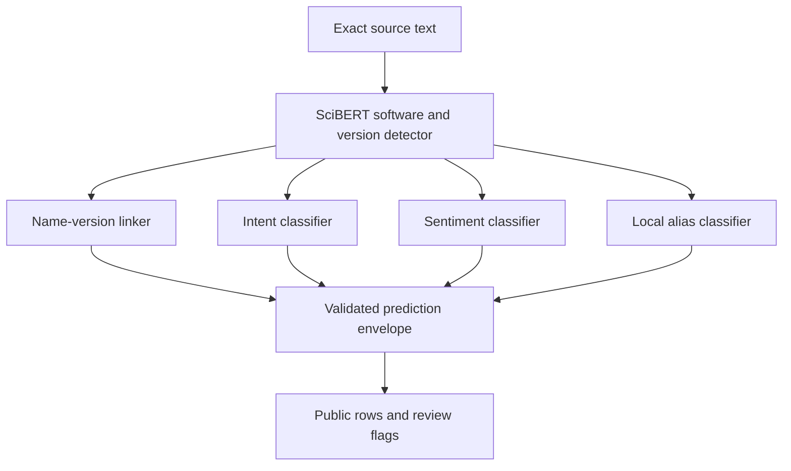

# Architecture

Each stage has its own encoder and task head. The full-label manifest refers to sibling checkpoint directories and pins their manifests by SHA-256. Stage manifests pin the weights and tokenizers. Files are verified before inference; preserve their bytes and relative layout when distributing a bundle.

| Responsibility | Source |
|---|---|
| Full pipeline, field validity and partial failures | `src/research/training/full_label.py` |
| Detector features and supervised field masks | `src/research/training/features.py` |
| Logit stitching and BIO decoding | `src/research/training/decode.py` |
| Optional, explicitly selected boundary rules | `src/research/training/boundary.py` |
| Linker, intent, sentiment and alias candidates | `src/research/training/attribute_features.py` |
| CLI and resident interactive model | `src/research/training/full_label_cli.py` |
| Dataset provenance and annotations | `src/research/data/`, `src/research/annotations/` |
| Matched input comparison | `src/research/comparison/` |
| Coverage-aware evaluation | `src/research/evaluation/` |

Machine-readable contracts are in `schemas/scibert-v2/`. Model inference is local and loads safetensors without remote custom code. Acquisition and optional external baseline adapters are separate commands. Legacy root-level research commands and the v2 pipeline coexist for historical compatibility; use the documented command groups for new work.

006 and 012 share the four attribute/linking heads. Their detectors have different training lineages. 012 reuses 011 weights with constrained wordpiece decoding; its name is not evidence of universal improvement over 006.
